## GPS

    

<h3>Глобальная система позиционирования (GPS): для чего она нужна эпидемиологу?</h3>
 

В данной лекции мы рассмотрим работу с пространственными данными с использованием системы глобального позиционирования.

 

--- 

## Эпидемиология и пространственные данные

> 1. Эпидемиология - это наука и практическая дисциплина о причинах и условиях возникновения и распространения заболеваний и патологических состояний в определённой популяции.
> 2. Описательная эпидемиология призвана ответить на вопросы "Что?" (описание случая), "Кто?" (описание популяции), "Когда?" (время возникновения или регистрации случаев) и "Где?" (место регистрации случаев).
> 3. Поэтому описание любой эпидемической вспышки или фоновой ситуации невозможно без оперирования **пространственными данными**.

--- 

## Пространственные данные

> 1. **Под пространственными данными** (иначе географические данные или геоданные) понимают данные о пространственных объектах и их наборах. Проще говоря, пространственные данные имеют привязку к каким-либо координатам земной поверхности.
> 2. В своей практической работе эпидемиологи имеют дело как раз-таки с пространственными данными: заболеваемость в разрезе административных территорий (области, районы), абсолютные числа заболевших в тех или иных учреждениях, качество водоснабжения в населённых пунктах и т. п. 
> 3. Эпидемиология занимается анализом пространственных ("где?") и связанных (атрибутивных)данных.

---

## Пространственная эпидемиология

Пространственная эпидемиология занимается описанием и анализом причин территориального (географического) распределения заболеваний:
> - Картирование заболеваний;
> - Пространственный анализ (анализ наложением, пространственно-временная корреляция и т. п.);
> - Кластеризация и надзор за распространением заболеваний.

---

## Джон Сноу и картирование заболеваний

> - Карты, планы и схемы очень часто используются эпидемиологами в расследовании вспышек заболеваний.
> - Самым ранним документированным эпидемиологическим исследованием, использующим картирование и пространственный анализ, является изучение вспышки холеры в Лондоне английским врачом Джоном Сноу.
> - В 1854 году в квартале Лондона, Сохо, возникла обширная вспышка холеры: всего за три дня более  120 человек умерли от этой инфекции. Джон Сноу отметил местоположения случаев смерти от холеры на карте города и обнаружил, что они были сгруппированы вокруг водяного насоса на Broad Street. Он предложил, чтобы насос был выведен из обслуживания (была демонтирована рукоятка насоса), что помогло купировать распространение эпидемии. Это позволило ему сформулировать теорию распространения холеры через загрязнённую воду.

---

## Оригинальная карта Джона Сноу

    

---

## Карта Джона Сноу, воспроизведённая в Quantum GIS

    

----

## Теплокарта распространения клещевого боррелиоза (QGIS)

    

---

## ArcGIS Online

    

---

## ГИС (географические информационные системы)

    

- Географическая информационная система - единый комплекс взаимодействующих компьютерных программ для хранения пространственных и аттрибутивных данных, а также их организации, анализа, обмена и отображения в географическом контексте (картирования).
- Свойства ГИС идеальны для эпидемиологического надзора за инфекционными заболеваниями, контроля их распространения и изучения вспышек.

---

## Получение пространственных данных для ввода в ГИС

    

Географические координаты для включения их в пространственные данные могут быть получены в геодезических изысканиях с помощью теодолита (самый старый способ)...

---

## Получение пространственных данных для ввода в ГИС

    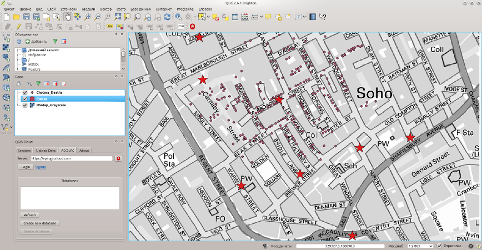

при изучении географических объектов с известными координатами (оцифровка старых карт).

---

## Получение пространственных данных для ввода в ГИС

    

Получение координат известных географических объектов (населённых пунктов) возможно на специализированных сайтах, например [LatLong](http://www.latlong.net/)...

---

## Получение пространственных данных для ввода в ГИС

    

или в программе [Google: планета Земля](https://www.google.com/earth/).

---

## Получение пространственных данных для ввода в ГИС

    

> * Однако наиболее удобным способом получения координат полевых объектов при расследовании вспышек, работе в природных очагах инфекций, выполнении эпидемиологических, эпизоотологических, паразитологических и др. исследований является использование возможностей глобальных систем позиционирования.
> * Полевые команды используют GPS для получения точных пространственных данных и создания точечных слоёв ГИС.

--- bg:darkgrey

     
     
     
     
     
     
     
     
     
    
        Немного теории
    

--- #blockquote

## Система глобального позиционирования: определение

> **Система глобального позиционирования** — это спутниковая система навигации, обеспечивающая измерение расстояния, времени и определяющая местоположениe во всемирной системе координат WGS 84. Позволяет в любом месте Земли (исключая приполярные области), почти при любой погоде, а также в околоземном космическом пространстве определять местоположение и скорость объектов.

 
*Система координат WGS 84 используется по умолчанию в проектах свободной ГИС Quantum GIS.*

---

## GPS: техническая реализация

    

---

## GPS: техническая реализация

    

GPS состоит из трёх основных сегментов: космического, управляющего и пользовательского. 
> - **Космический сегмент** представлен спутниками GPS, которые транслируют радиосигнал из космоса.
> - **Управляющий сегмент** представляет собой главную управляющую станцию и несколько дополнительных станций, а также наземные антенны и станции мониторинга.
> - **Пользовательский сегмент** представлен приёмниками GPS.

---

## Радар: измерение расстояния между двумя точками

    

Радар испускает короткий радиоимпульс большой силы. Этот импульс испускается в одном направлении в зависимости от ориентации антенны и распространяется со скоростью света c0.

Если в направлении распространения импульса есть препятствие, то радиоволна рассеивается во всех направлениях. Небольшая часть импульса отражается назад, к радару.

---

## Радар: измерение расстояния между двумя точками

    

Время возврата радиоволны t пропорционально расстоянию R до препятствия, которое может быть вычислено (в простейшем случае) по формуле:
$$
R = {{c_0 \times t} \over 2}
$$

Это пример определения линейной координаты объекта.

---

## GPS: вычисление трёхмерных координат

**Принцип**: Спутники GPS транслируют сигнал из космоса, и все приёмники GPS используют этот сигнал для вычисления своего положения в пространстве по трём координатам в режиме реального времени.

Для определения трёхмерных координат *x*, *y* и *z* GPS-приёмнику нужно иметь решённые уравнения «расстояние равно произведению скорости света на разность моментов приема сигнала потребителем и момента его синхронного излучения от спутников» для всех *i* спутников:

$$
d_i = c_0 \times (t_{t,i} - t_{r,i}) + t_c = \sqrt{(x_i - x)^2 + (y_i - y)^2 + (z_i - z)^2}
$$

---

## Ошибки GPS

    

На точность определения местоположения объекта с использованием GPS влияет [множество факторов](http://en.wikipedia.org/wiki/Error_analysis_for_the_Global_Positioning_System). 
Например, это могут быть атмосферные явления. Задержка возвращаемого сигнала может быть обусловлена действием солнечного ветра и геомагнитными явлениями в ионосфере. Эта задержка может достигать 300 наносекунд, что вызывает погрешность в определении местоположения объекта в 100 метров (J. A. Klobuchar, 1981).
В целом погрешность измерения времени возвращаемого сигнала составляет 10 наносекунд (3 - 5 метров). 

---

## Ошибки GPS

    

Сигнал GPS искажают:
> * Атмосферные явления;
> * Металлические конструкции;
> * Другие твёрдые образования (здания, горы и т. п.);
> * Электромагнитные поля (линии электропередач).

---

## Ошибки GPS

    

Понятно, что любое физическое препятствие на пути импульса искажает результат измерения.
Запомните следующие **правила**:
> 1. **"Чистое небо"**: используйте GPS приёмники на открытом пространстве, вдали от домов и деревьев.
> 2. Хотя для получения координат в GPS достаточно 3 спутников, выполнять их съёмку необходимо при подключении **не менее чем к 4 спутникам**.

---

## Глобальные спутниковые навигационные системы

> * США – **Global Positioning System (GPS)**: 32 спутника;
> * Россия - **Глобальная навигационная спутниковая система (ГЛОНАСС)**: 29 спутников;
> * ЕС - **Galileo**: 4 спутника; может взаимодействовать с GPS и ГЛОНАСС;
> * Китай - **Beidou**: 15 спутников.

--- bg:darkgrey

     
     
     
     
     
     
     
     
     
    
        Портативный GPS навигатор Garmin Dakota&#174; 20
    

---

## Внешний вид навигатора Garmin Dakota 20

    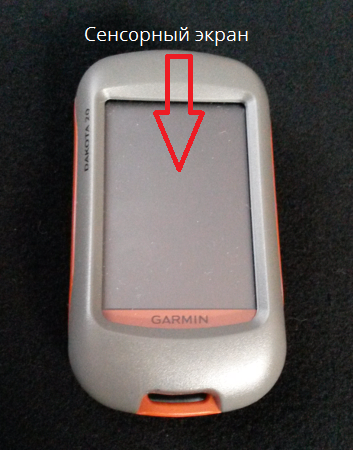

---

## Garmin Dakota: кнопка питания

<table width="100%" cellpadding="0" cellspacing="0">
	<tr valign="top">
		<td width="50%" style="border: none; padding: 0cm">
			
		</td>
		<td width="50%" style="border: none; padding: 0cm">
        <ul>
			<li><b>Для включения</b> Dakota нажмите кнопку питания;</li>
            <li><b>Для  выключения</b> Dakota нажмите и удерживайте кнопку питания;</li>
            <li><b>Для блокировки и разблокировки</b> экрана нажмите и быстро отпустите кнопку питания.</li>
        </ul>    
		</td>
	</tr>
</table>

--- bg:darkgrey

     
     
     
     
     
     
     
     
     
    
        Подключение элементов питания
    

---

## Задняя поверхность Garmin Dakota

    

---

## Подключение элементов питания

    

> * Сдвиньте защёлку для того, чтобы снять крышку отсека батарей. 
> * Устройство Garmin Dakota работает от двух элементов питания типа AA ("пальчиковые" батарейки).
> * Также можно использовать подзаряжаемые NiMH аккумуляторы.
> * Вставьте элементы питания в отсек, совместив метки + и - на устройстве и элементах питания.
> * Закройте крышку отсека.
> * Если вы не собираетесь длительное время (несколько месяцев) использовать устройство, то извлеките элементы питания. Данные на устройстве при этом не теряются.

--- bg:darkgrey

     
     
     
     
     
     
     
     
     
    
        BaseCamp: перед тем, как в первый раз включить навигатор
    

---

## Garmin Dakota: обновление в программе BaseCamp

<table width="100%" cellpadding="0" cellspacing="0">
    <tr valign="top">
		<td width="50%" style="border: none; padding: 0cm">
			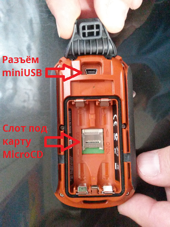
		</td>
		<td width="50%" style="border: none; padding: 0cm">
        <ul>
			<li>До начала работы с Garmin Dakota необходимо обновить прошивку устройства, используемые карты, а также дополнительное программное обеспечение.</li>
            <li>Garmin Dakota может подключаться к компьютеру с помощью кабеля через интерфейс USB. На устройство могут быть записаны пользовательские файлы, как на обычный флеш-брелок (встроенная память устройства составляет 850 Мб; кроме того, может быть подключена дополнительная карта памяти).</li>
        </ul>    
		</td>
	</tr>
</table>

---

## Garmin Dakota: обновление в программе BaseCamp

> - Тем не менее, обновление программного обеспечения устройства осуществляется не прямым копированием, а через специальную программу, [**BaseCamp**](http://download.garmin.com/software/BaseCamp_446.exe) (раньше для этого использовалась программа **MapSource**).
> - Русскоязычную версию BaseCamp для ПК можно загрузить по ссылке http://www8.garmin.com/support/download_details.jsp?id=4435
> - После загрузки файла программы-установщика запустите её и согласитесь с внесением изменений в Windows.

---

## BaseCamp: этапы установки

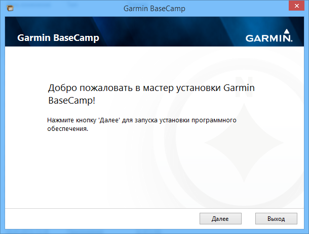

---

## BaseCamp: этапы установки

---

## BaseCamp: этапы установки

---

## BaseCamp: этапы установки

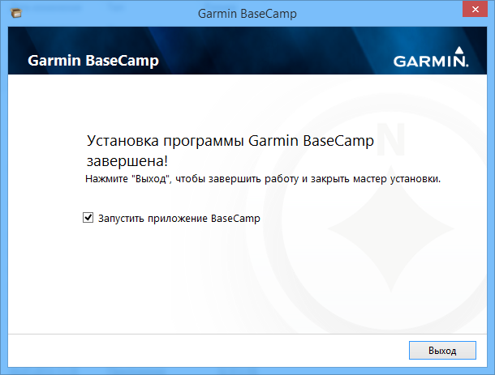

---

## BaseCamp: первый запуск

---

## BaseCamp: первый запуск

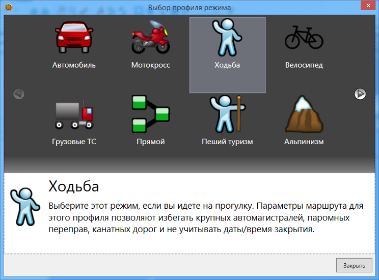

---

## BaseCamp: первый запуск

---

## BaseCamp: обучающее видео

---

## BaseCamp: обучающее видео

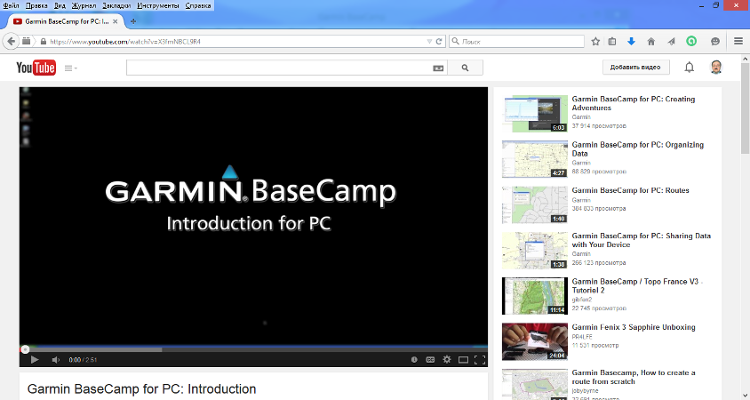

При щелчке по пункту меню происходит переход на страницу [Youtube](https://www.youtube.com/watch?v=X3fmNBCL9R4) с обучающими видео по работе с программой (на английском языке).

---

## Garmin Dakota: обновление в программе BaseCamp

> - После запуска BaseCamp, не закрывая программу,  необходимо подключить устройство Garmin Dakota к компьютеру через USB порт(устройство можно не включать).
> - Слева, в разделе "Устройства", появится идентификатор Garmin Dakota 20, а также значки для доступа к его внутренней памяти и к предустановленной базовой карте.

---

## Garmin Dakota: обновление в программе BaseCamp

Щёлкните **правой** кнопкой мыши по значку предустановленной карты и в контекстном меню выберите пункт *"Проверить обновление ПО: Dakota 20"*.

---

## Garmin Dakota: обновление в программе BaseCamp

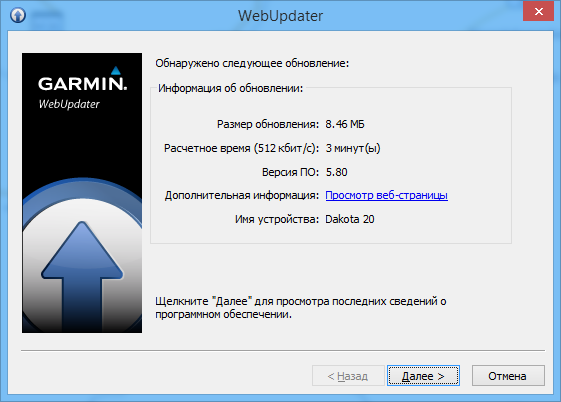

---

## Garmin Dakota: обновление в программе BaseCamp

---

## Garmin Dakota: обновление в программе BaseCamp

---

## Garmin Dakota: обновление в программе BaseCamp

---

## Garmin Dakota: обновление в программе BaseCamp

---

## Garmin Dakota: обновление в программе BaseCamp

---

## Garmin Dakota: обновление в программе BaseCamp

---

## Garmin Dakota: загрузка дополнительных карт

<table width="100%" cellpadding="0" cellspacing="0">
    <tr valign="top">
    	<td width="50%" style="border: none; padding: 0cm">
        

			
        

		</td>
		<td width="50%" style="border: none; padding: 0cm">
        

            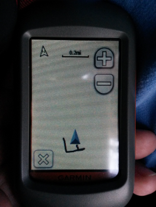 
        

		</td>
	</tr>
</table>

К сожалению, предустановленная в устройстве Garmin Dakota карта обладает низким уровнем детализации, что делает её непригодной для эпидемиологической работы. Это требует установки на устройство дополнительных карт.

---

## Garmin Dakota: загрузка дополнительных карт

> - На [сайте компании Garmin](https://my.garmin.com/maps/nuMaps.htm) представлен ряд карт как для покупки, так и для бесплатной загрузки (nüMaps).
> - К сожалению, официальных карт Казахстана там нет. Это требует загрузки на устройство карт других производителей.

---

## Garmin Dakota: загрузка дополнительных карт

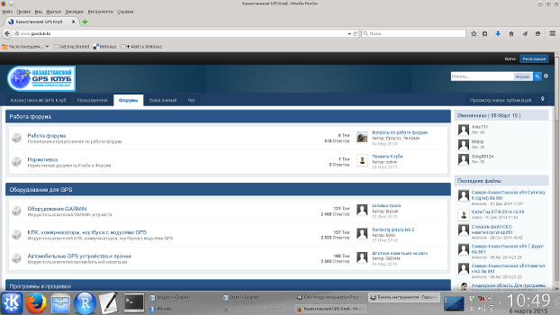

> - Карты для навигаторов распространяются в виде файлов с расширением \*.img. 
> - Хорошим источником карт для Казахстана является [Казахстанский GPS клуб](http://www.gpsclub.kz/) (требуется бесплатная регистрация).

---

## Garmin Dakota: загрузка дополнительных карт

> - Вначале \*.img карта должна быть **установлена на компьютер**. После подключения к компьютеру устройства Garmin эта карта устанавливается на навигатор **с помощью программы BaseCamp**.
> - Коммерческие карты располагают также программами-установщиками, которые корректно регистрируют карты в системе для того, чтобы их "видела" программа BaseCamp.
> - Свободно распространяемые карты представлены только файлом \*.img, поэтому их нужно установить на компьютер с помощью программ [MapSetToolKit](http://meridian.perm.ru/04_maps/gpsimg/bin/MapSetToolKit_v1.77.zip) и [cGPSmapper](http://meridian.perm.ru/04_maps/gpsimg/bin/cgpsmapperFree.zip).

---

## Garmin Dakota: загрузка дополнительных карт

*Установим на устройство Garmin Dakota свободно распространяемую карту Казахстана (основанную на OpenStreet Map)*.

> 1. Карту можно загрузить по [ссылке](http://www.gpsvsem.ru/map.php?id=994) или найти в каталоге "Map" раздаточных материалов лекции.
> 2. Программы *MapSetToolKit* и *cGPSmapper* можно загрузить по ссылкам на предыдущем слайде или найти в раздаточных материалах лекции в папке "Software". Программы не требуют установки.
> 3. Перед началом работы закройте программу *BaseCamp*.

---

## Garmin Dakota: загрузка дополнительных карт

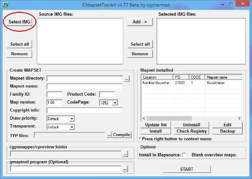

> - Запустите программу *MapSetToolKit*.
> - Нажмите кнопку *"Select IMG"* для того, чтобы выбрать **папку**, в которой содежится файл \*.img нужной карты. 

--- bg:red

     
     
     
     
     
     
     
     
     
    
        ВНИМАНИЕ!  
        Имя карты должно быть в формате:   
        "восемь любых цифр + расширение имени файла"   
        (другие файлы программа "не видит").   
        Например, имя карты может быть <i>12345678.img</i>.
    

---

## Garmin Dakota: загрузка дополнительных карт

- В диалоговом окне выберите нужное имя папки.

---

## Garmin Dakota: загрузка дополнительных карт

- Выберите мышью имя карты в списке *"Source IMG files"* и нажмите кнопку *"Add"* для того, чтобы добавить эту карту в список *"Selected IMG files"*.

---

## Garmin Dakota: загрузка дополнительных карт

> - На компьютер можно устанавливать не только одну карту но и целый набор (mapset).
> - Но даже если устанавливается одна карта, она называется "набором".
> - Создайте папку для установки этого набора карт (карты). Например, *"Документы/Garmin/Kazakhstan"*.
> - Нажмите кнопку *"..."* возле поля *"Mapset directory"* для того, чтобы выбрать папку для установки карты на компьютер.

---

## Garmin Dakota: загрузка дополнительных карт

- В диалоговом окне выберите каталог установки.

---

## Garmin Dakota: загрузка дополнительных карт

> - В выпадающем списке *"CodePage"* выберите значение *"1251"*.
> - Нажмите кнопку *"..."* рядом с полем *"TYP files"* для того, чтобы выбрать вспомогательный файл \*.typ.

---

## Garmin Dakota: загрузка дополнительных карт

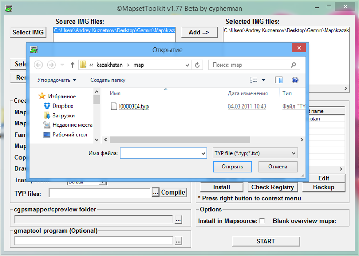

---

## Garmin Dakota: загрузка дополнительных карт

> - При установке карты важно иметь лишь файл \*.img. Файлы \*.typ могут и отсутствовать. Это не препятствует установке карты на компьютер.
> - В случае отсутствия файла \*.typ в поле *"Family ID"* (идентификатор семейства) вводим любое число. Оно должно быть уникальным среди всех наборов карт, установленных на вашем компьютере (все их видно справа в таблице *"Mapset installed"* в колонке *"FID"*).
> - Если вы используете файл \*.typ, всё равно в поле *"Family ID"* введите любое число (оно потом будет изменено на другое, взятое из файла \*.typ).

---

## Garmin Dakota: загрузка дополнительных карт

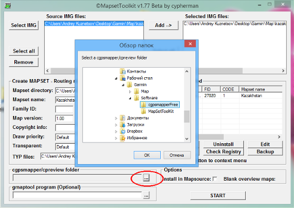

- Нажмите кнопку *"..."* рядом с полем *"cgpsmapper/cpreview folder"*, чтобы выбрать папку, в которой находится программа *"cGPSmapper"*.

---

## Garmin Dakota: загрузка дополнительных карт

- *Важно!* Поставьте флажок в переключателе *"Install in Mapsorce"* для того, чтобы устанавливаемая карта была "видна" в программе *BaseCamp*.

---

## Garmin Dakota: загрузка дополнительных карт

    

> - Нажмите кнопку *"START"* для того, чтобы установить карту на компьютер.
> - Если вы использовали \*.typ файл, то появится диалоговое окно, предлагающее согласовать код продукта с таковым из TYP файла. Примите это предложение.
> - После появления нескольких консольных (чёрных) окон в конце должно появиться окошко с сообщением *"Convert completed"*. Это означает, что карта успешно установлена на компьютер.
> - Теперь можно установить её на навигатор. Запустите программу *BaseCamp* и подключите через USB порт устройство Garmin Dakota.

---

## Garmin Dakota: загрузка дополнительных карт

    

> - Выберите установленную карту в выпадающем списке в левой части программы *BaseCamp*.
> - Если этот список отсутствует, щёлкните правой кнопкой мыши по свободному месту инструментальной панели и выберите в контекстном меню пункт *"Карты"*.

---

## Garmin Dakota: загрузка дополнительных карт

    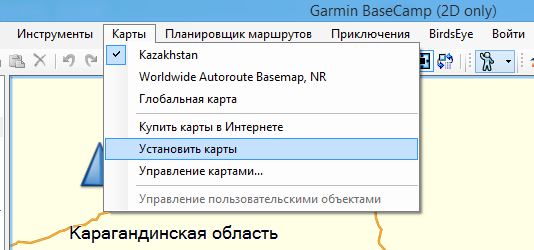

- Выберите в меню программы *BaseCamp* Карты - Установить карты.

---

## Garmin Dakota: загрузка дополнительных карт

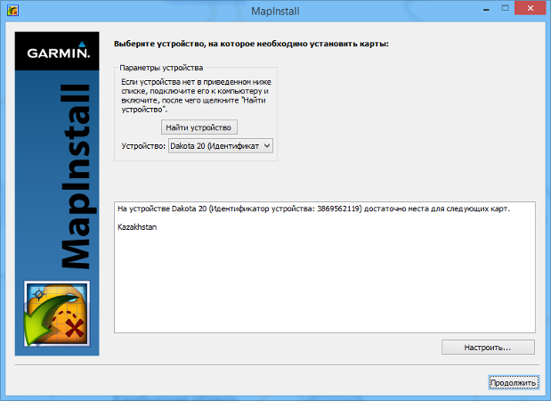

---

## Garmin Dakota: загрузка дополнительных карт

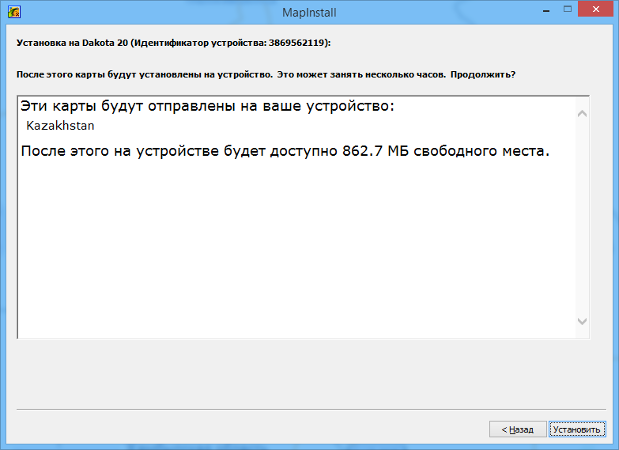

---

## Garmin Dakota: загрузка дополнительных карт

---

## Garmin Dakota: загрузка дополнительных карт

--- bg:darkgrey

     
     
     
     
     
     
     
     
     
    
        Полевая работа с Garmin Dakota&#174; 20
    

--- bg:lightblue

     
     
     
     
     
     
     
     
     
    
        Подключение к спутникам
    

--- &radio

## Проверьте себя

С каким числом спутников должно установить соединение устройство Garmin Dakota для корректного определения географических координат?

1. Достаточно связи с одним спутником;
2. С двумя;
3. С тремя;
4. _С четырьмя и более_.

*** .hint

Необходимо по одному спутнику для каждой из координат в трёхмерном пространстве плюс ещё как минимум один - для коррекции координат.

*** .explanation

Один спутник позволяет установить только расстояние между объектами. Два спутника позволяют установить координаты в двумерном пространстве, три - в трёхмерном (x, y, z). Однако, поскольку при рассеянии сигнала со спутников препятствиями и атмосферными явлениями возникает погрешность в определении координат, необходимо большее число спутников для корректировки вычисления. Поэтому правильный ответ - 4.

--- &radio

## Проверьте себя

Что влияет на качество сигнала, получаемого от спутников?

1. Горы;
2. Линии электропередач;
3. Здания;
4. _Всё вышеизложенное_.

*** .hint

Задержка прохождения сигнала вызывает погрешность в определении координат.

*** .explanation

На качество сигнала, получаемого от спутников, влияют атмосферные явления, электромагнитные поля и любые физические препятствия. Поэтому правильный ответ - 4.

---

## Garmin Dakota: подключение к спутникам

> - После включения навигатора на дисплее появляется страница-приветствие, а затем страница главного меню.
> - Для возможности уверенного приёма сигналов со спутников следует находиться вдали от высоких зданий, деревьев и линий электропередач. Основное правило включения навигатора: **беспрепятственный обзор неба**.
> - Включение навигатора в помещении приводит к напрасной трате энергии в батарее, т. к. устройство напрасно ищет спутники.

---

## Garmin Dakota: подключение к спутникам

Для расчёта текущего местоположения навигатор в течение определённого времени должен собрать необходимые спутниковые данные. Различают три типа режима определения местоположения навигатора: *холодный*, *тёплый* и *горячий* старт.

> - При **холодном старте** навигатор не имеет информации о своём местонахождении, поэтому поиск спутников занимает продолжительное время — до 20 и более минут в зависимости от внешних условий. Обычно холодный старт наблюдается при первом включении навигатора или при перемещении на значительное расстояние от места предыдущего включения.
> - **Тёплый старт** означает, что навигатор сохранил в памяти альманах, полученный при предыдущем включении, а также сохранил информацию о времени, пусть и с небольшой погрешностью. Время приёма сигнала при этом сокращается до нескольких минут.

---

## Garmin Dakota: подключение к спутникам

Для расчёта текущего местоположения навигатор в течение определённого времени должен собрать необходимые спутниковые данные. Различают три типа режима определения местоположения навигатора: *холодный*, *тёплый* и *горячий* старт.

> - Наконец, **горячий старт** — когда навигатор был выключен совсем недавно и данные альманаха и эфемерид не успели устареть. Время позиционирования может быть сокращено до 10–20 секунд.

---

## Garmin Dakota: подключение к спутникам

Включите устройство для выхода в главное меню.

<table width="100%" cellpadding="0" cellspacing="0">
    <tr valign="top">
		<td width="50%" style="border: none; padding: 0cm">
			
		</td>
		<td width="50%" style="border: none; padding: 0cm">
        <ul>
			<li>В нижней части главного меню имеется индикатор связи со спутниками;</li>
            <li>В случае отсутствия связи полоски индикатора будут серыми; число зелёных полосок указывает на силу соединения;</li>
            <li>Для  отображения страницы связи со спутниками нажмите и удерживайте примерно 2 секунды значок индикатора.</li>
        </ul>    
		</td>
	</tr>
</table>

---

## Garmin Dakota: подключение к спутникам

<table width="100%" cellpadding="0" cellspacing="0">
    <tr valign="top">
    	<td width="50%" style="border: none; padding: 0cm">
			
		</td>
		<td width="50%" style="border: none; padding: 0cm">
        <ul>
			<li>На дисплее навигатора будет схематично показано расположение спутников относительно Вашего текущего местоположения;</li>
            <li>Внешняя окружность соответствует линии горизонта, внутренняя – 45 градусов над горизонтом;</li>
            <li>На схеме также показаны номера спутников. Гистограмма в нижней части дисплея показывает мощность сигналов, регистрируемую навигатором от каждого спутника.</li>
        </ul>    
		</td>
	</tr>
</table>

---

## Garmin Dakota: подключение к спутникам

    

--- bg:lightblue

     
     
     
     
     
     
     
     
     
    
        Настройка Garmin Dakota&#174; 20
    

---

## Garmin Dakota: настройка

    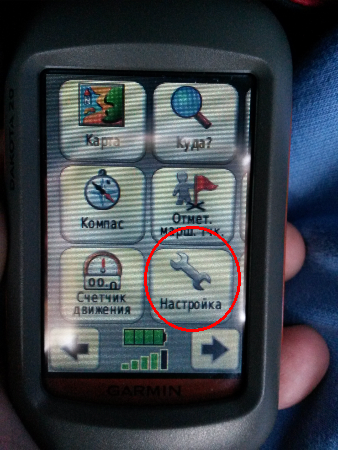

В главном меню нажмите на кнопку *"Настройка"* для перехода к странице настроек устройства.

---

## Garmin Dakota: настройка

<table width="100%" cellpadding="0" cellspacing="0">
    <tr valign="top">
        <td width="50%" style="border: none; padding: 0cm">
			
		</td>
		<td width="50%" style="border: none; padding: 0cm">
        <ul>
			<li>Кнопки страницы настройки предоставляют доступ ко многим разделам;</li>
            <li>Нас интересуют лишь кнопки <i>Система</i>, <i>Отображение</i>, <i>Карта</i> и <i>Единицы</i>;</li>
            <li>Для доступа к кнопке <i>Единицы</i>, выходящей за пределы экрана навигатора, используйте кнопку "Стрелка вниз".</li>
        </ul>    
		</td>
	</tr>
</table>

---

## Garmin Dakota: настройка

    

> - Нажмите кнопку *"Система"* для того, чтобы перейти к настройке основных параметров устройства.
> - Здесь требует настройки лишь тип GPS. Нажмите на верхнюю кнопку страницы.

---

<table width="100%" cellpadding="0" cellspacing="0">
    <tr valign="top">
        <td width="50%" style="border: none; padding: 0cm">
    		
		</td>
		<td width="50%" style="border: none; padding: 0cm">
        <ul>
			<li>В Garmin Dakota 20 имеется 3 типа GPS: нормальный, WAAS и демо-режим.</li>
            <li>WAAS (англ. wide area augmentation system) — система распространения поправок к данным, передаваемым навигационной системой GPS. Дополняет GPS, повышая точность определения координат.</li>
            <li>Демо-режим имитирует GPS без реального подключения к спутникам.</li>
        </ul>    
		</td>
	</tr>
</table>
 

К сожалению, WAAS действует лишь на территории северной Америки. Поэтому нам нужно включить **нормальный** режим GPS.

---

## Garmin Dakota: настройка

    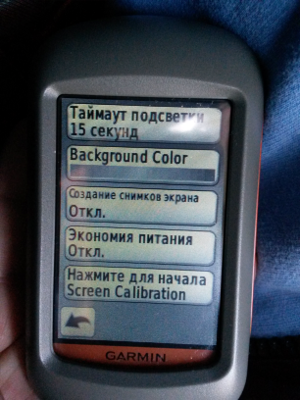

> - Нажмите кнопку *"Отображение"* на странице главного меню для того, чтобы перейти к настройке основных параметров отображения графических элементов на экране устройства.
> - Здесь требует настройки лишь калибровка экрана. Нажмите на нижнюю кнопку страницы.

---

## Garmin Dakota: настройка

<table width="100%" cellpadding="0" cellspacing="0">
    <tr valign="top">
        <td width="50%" style="border: none; padding: 0cm">
        	
		</td>
		<td width="50%" style="border: none; padding: 0cm">
            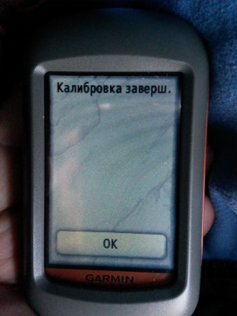
		</td>
	</tr>
</table>

> - Для того, чтобы навигатор правильно реагировал на нажатия пальцем на сенсорный экран, последний следует откалибровать.
> - Для этого необходимо последовательно прикоснуться к чёрным точкам пальцем и подтвердить окончание калибровки.

---

## Garmin Dakota: настройка

    

> - Нажмите кнопку *"Карта"* на странице главного меню для того, чтобы перейти к настройке карт устройства.
> - Здесь требует настройки лишь отображение нужных карт на устройстве. Нажмите на нижнюю кнопку страницы.

---

## Garmin Dakota: настройка

<table width="100%" cellpadding="0" cellspacing="0">
    <tr valign="top">
        <td width="50%" style="border: none; padding: 0cm">
            
		</td>
		<td width="50%" style="border: none; padding: 0cm">
            
		</td>
	</tr>
</table>

> - Для того, чтобы настроить какую-либо карту, нужно нажать на её кнопку.
> - На странице карты нажмите кнопку *"i"* для того, чтобы просмотреть информацию об этой карте.
> - Для отключения карты нажмите кнопку *"Отключить."*

---

## Garmin Dakota: настройка

<table width="100%" cellpadding="0" cellspacing="0">
    <tr valign="top">
        <td width="50%" style="border: none; padding: 0cm">
            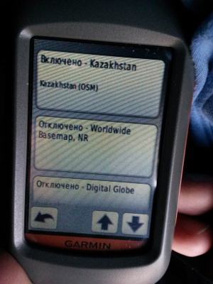
    	</td>
		<td width="50%" style="border: none; padding: 0cm">
            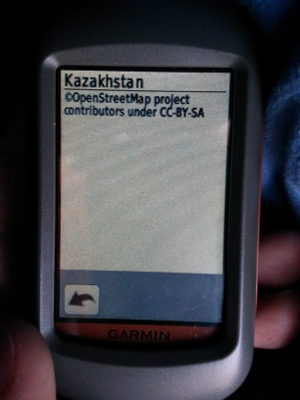
		</td>
	</tr>
</table>
 

На имеющемся у вас устройстве Garmin Dakota следует отключить все карты, кроме ранее установленной карты Казахстана.

---

## Garmin Dakota: настройка

**Самостоятельная работа**

1. Включите устройство Garmin Dakota.
2. Перейдите на страницу настроек устройства, переключите GPS в режим *"Demo"*.
3. Вернитесь в меню настройки, переключите устройство с американских единиц измерения на метрические.

 
<a class="btn btn-large btn-danger" rel="popover" data-content="В главном меню нажмите кнопку <i>Настройка</i>.   На странице настройки нажмите кнопку <i>Стрелка вниз</i>.   Нажмите кнопку <i>Единицы</i>.   Нажимайте по очереди все кнопки и затем нажимайте кнопку <i>Метрические</i>." data-original-title="" id='example'>Нажмите для подсказки</a>

--- bg:lightblue

     
     
     
     
     
     
     
     
     
    
        Снятие топографической информации
    

---

## Garmin Dakota: путевые точки

    

> - **Путевыми точками** называются местоположения или отметки на электронной карте навигатора, которые можно записывать в память прибора.
> -  Путевые точки используются при составлении маршрутов, а также для прямолинейной навигации в режиме **СТАРТ** к выбранной путевой точке.
> - Путевые точки навигатора могут быть экспортированы в качестве слоёв ГИС и стать основой для создания пространственных данных.

---

## Garmin Dakota: путевые точки

    

Существует несколько способов создания путевых или, в терминах Garmin Dakota, *маршрутных* точек.

> - Во-первых, можно нажать кнопку *"Отмет. марш. тчк."* в главном меню навигатора для того, чтобы отметить текущее положение исследователя в качестве маршрутной точки (самый точный способ).

---

## Garmin Dakota: путевые точки

<table width="100%" cellpadding="0" cellspacing="0">
    <tr valign="top">
		<td width="33%" style="border: none; padding: 0cm">
			

		</td>
		<td width="33%" style="border: none; padding: 0cm">
			

		</td>
		<td width="33%" style="border: none; padding: 0cm">
			
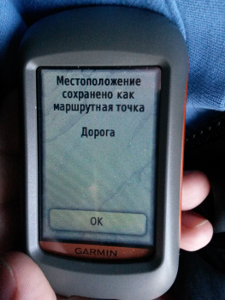

		</td>
	</tr>
</table>

> - Во-вторых, независимо от того, находится навигатор в режиме приёма спутниковых сигналов 2D/3D или GPS отключён, путевую (маршрутную) точку можно создать с помощью страницы карты. Находясь на странице карты надо, прикоснувшись пальцем к сенсорному экрану, поместить указатель в виде булавки на объект / точку, для которых надо создать маршрутную точку. 
> - Рядом с названием объекта (точки) необходимо нажать на кнопку с тремя полосками для перехода на страницу управления маршрутной точкой.

---

## Garmin Dakota: путевые точки

<table width="100%" cellpadding="0" cellspacing="0">
    <tr valign="top">
    	<td width="33%" style="border: none; padding: 0cm">
			

		</td>
		<td width="33%" style="border: none; padding: 0cm">
			

		</td>
		<td width="33%" style="border: none; padding: 0cm">
			

		</td>
	</tr>
</table>

> - Сохранить маршрутную точку можно, нажав на кнопку с флажком.

---

## Garmin Dakota: путевые точки

<table width="100%" cellpadding="0" cellspacing="0">
    <tr valign="top">
        <td width="33%" style="border: none; padding: 0cm">
			

		</td>
		<td width="33%" style="border: none; padding: 0cm">
			
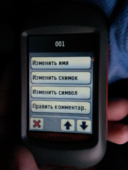

		</td>
		<td width="33%" style="border: none; padding: 0cm">
			

		</td>
	</tr>
</table>
 

> - После создания путевой точки можно сохранить её с параметрами по умолчанию, нажав кнопку *"Сохранить"* либо изменить её имя или другие параметры, нажав кнопку *"Сохранить и править"*. 
> - Принять изменения можно, нажав на кнопку с зелёным флажком.

---

## Garmin Dakota: путевые точки

<table width="100%" cellpadding="0" cellspacing="0">
    <tr valign="top">
        <td width="33%" style="border: none; padding: 0cm">
    		
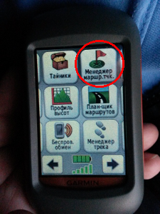

		</td>
		<td width="33%" style="border: none; padding: 0cm">
			
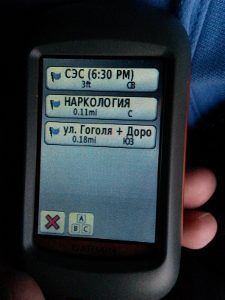

		</td>
		<td width="33%" style="border: none; padding: 0cm">
			

		</td>
	</tr>
</table>
 

> - Доступ к созданным пользователем путевым точкам можно получить с помощью кнопки *"Менеджер маршр. тчк."* главного меню.
> - Получить доступ к странице путевой точки можно, нажав на кнопку с её именем.

---

## Garmin Dakota: путевые точки

<table width="100%" cellpadding="0" cellspacing="0">
    <tr valign="top">
        <td width="33%" style="border: none; padding: 0cm">
        	

		</td>
		<td width="33%" style="border: none; padding: 0cm">
			

		</td>
		<td width="33%" style="border: none; padding: 0cm">
			

		</td>
	</tr>
</table>
 

> - Отредактировать свойства путевой точки можно, нажав на кнопку с изображением карандаша на её странице.
> - В том числе можно удалить путевую точку. Для того, чтобы увидеть кнопку удаления, нажмите дважды кнопку *"Стрелка вниз"* на странице точки.

---

## Garmin Dakota: маршруты и треки

<table width="100%" cellpadding="0" cellspacing="0">
    <tr valign="top">
        <td width="33%" style="border: none; padding: 0cm">
            

		</td>
		<td width="33%" style="border: none; padding: 0cm">
			

		</td>
		<td width="33%" style="border: none; padding: 0cm">
			

		</td>
	</tr>
</table>
 

> - **Маршрут** представляет собой последовательность нескольких промежуточных путевых точек, которые приведут Вас к конечному пункту назначения. Точки соединены линией - предполагаемым направлением движения.
> - Направление движения (пройденный путь) называется **треком**.

---

## Garmin Dakota: маршруты и треки

<table width="100%" cellpadding="0" cellspacing="0">
    <tr valign="top">
        <td width="33%" style="border: none; padding: 0cm">
            

    	</td>
		<td width="33%" style="border: none; padding: 0cm">
			

		</td>
		<td width="33%" style="border: none; padding: 0cm">
			

		</td>
	</tr>
</table>
 

> - В памяти устройства Garmin Dakota может храниться до 200 треков и до 10 000 точек пройденного маршрута.
> - Для доступа на страницу управления треками нужно нажать на кнопку *"Менеджер трека"* главного меню.

---

## Garmin Dakota: маршруты и треки

<table width="100%" cellpadding="0" cellspacing="0">
    <tr valign="top">
        <td width="33%" style="border: none; padding: 0cm">
            

        </td>
		<td width="33%" style="border: none; padding: 0cm">
			

		</td>
		<td width="33%" style="border: none; padding: 0cm">
			

		</td>
	</tr>
</table>
 

Создание и изменение маршрутов происходит с помощью *"Страницы маршрутов"* (для доступа к ней необходимо нажать кнопку *"План-щик маршрутов"*.

--- bg:red

     
     
     
     
     
     
     
     
     
    
        ВНИМАНИЕ!  
        Полноценные маршруты удобнее создавать на компьютере   
        в программе BaseCamp   
        (впоследствии их можно экспортировать на устройство).  
    

--- bg:darkgrey

<a name='3'>

     
     
     
     
     
     
     
     
     
    
        Работа с маршрутами и треками в BaseCamp
    

</a>

---

## BaseCamp: маршруты и треки

---

## BaseCamp: маршруты и треки

---

## BaseCamp: маршруты и треки

---

## BaseCamp: маршруты и треки

---

## BaseCamp: маршруты и треки

--- bg:#CBE7A5

     
     
     
     
     
     
     
     
     
    
        В последующем карту kml можно просмотреть в Google Earth  
        или добавить в QuantumGIS в виде точечного слоя.  
        Но это уже другая история...  
    

--- bg:lightblue

   <b>Об авторе</b>  
   
     
  <b>Кузнецов Андрей Николаевич</b>  
   <i>к. м. н., с. н. с. лаборатории бруцеллёза   
   Казахского научного центра карантинных и зоонозных инфекций  
   <a href='mailto:linmedsoft@gmail.com'>linmedsoft@gmail.com</a>  
   <a href='mailto:akuznecov@kscqzd.kz'>akuznecov@kscqzd.kz</a>  
   <a href='https://www.linkedin.com/in/andreynkuznetsov'>Сеть профессионалов LinkedIn</a>  
   <a href='http://www.researchgate.net/profile/Andrey_Kuznetsov11'>Сеть исследователей ResearchGate
</a>
   </i>

